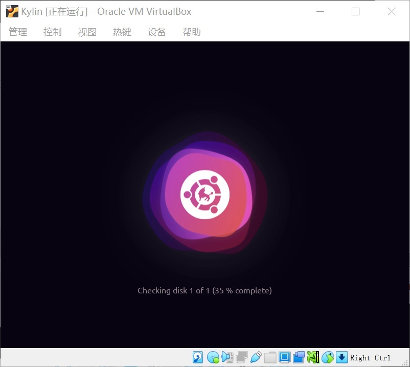

# Ubuntu Kylin 20.04 LTS 安装说明 #

`Author: Lin`

现在Linux系统安装程序一般都有很好的图形界面，尤其是Ubuntu Kylin里几乎没有可能给后边带来很大麻烦的“隐藏设置”，按照提示一路确认，一般没有问题的。**唯一要格外小心的就是分区设置**，如果硬盘里有需要保留的东西最好先备份一下。
 
## 1. 安装镜像下载

优麒麟的安装盘镜像可以在 [Ubuntu Kylin官网](https://www.ubuntukylin.com/downloads/) 下载。默认（官方推荐）为20.04 LTS版；如有必要也可以在页面上找其他版本的下载地址。

## 2. 系统安装

        注意：由于安装操作系统可能会对硬盘上的文件造成影响，建议新手使用虚拟机方式安装。

### 2.1 准备工作

+ 物理机

a.	备份硬盘上的数据以防万一

b.	准备刻录机、刻录盘 或者 容量8GB以上（含）的U盘

c.	将镜像刻录到光盘上，*或者* 用[rufus](http://rufus.ie/zh/)将镜像写入U盘

+ 虚拟机

        注意：这里假设您使用的是64位机器和64位Windows操作系统。

a. 确保主板已经打开虚拟化功能。可以在任务管理器里查看。

如果尚未启用，则需要重启按`F2`或者`Del`入BIOS设置（不同机器快捷键可能不一样，请查阅对应型号的文档），打开CPU的Intel `VT`或者AMD `SVM`选项，保存设置然后重新启动。

b. 安装Virtual Box虚拟机

[VBox]( https://www.virtualbox.org/wiki/Downloads)是目前比较好用的虚拟机，安装包不大，文件共享也很方便。如果有其他熟悉的虚拟机也可以，只要能安装Linux就行。

c. 创建一个空的虚拟机

名称随意，文件夹默认即可（如果C盘不大可以在其他分区创建一个文件夹），类型选择Linux，版本选择Ubuntu (64-bit)。然后按照提示即可，**内存和硬盘建议稍微调大一些**。一般情况下，运行教程里的软件用4G内存、30G硬盘的虚拟就就足够了，甚至1G内存、10G硬盘这套默认配置也还可以。虚拟机默认使用1个CPU核心，可以适当调高一些，但不要超过CPU的物理核心数。

### 2.2 从安装盘启动

+ 物理机

将光盘或者U盘插好，重启按`F8`或者`F12`进入启动选项菜单（不同机器快捷键可能不一样，请查阅对应型号的文档），选择从对应设备启动。

+ 虚拟机

第一次启动虚拟机时会要求选择系统光盘镜像。也可以在菜单中加载光盘镜像。

接下来的步骤虚拟机和物理机操作基本相同，不再分开说明。

### 2.3 安装系统

+ 系统启动阶段会检查介质有无损坏，可以按Ctrl+C跳过。

+ b经过一段时间后，进入安装界面（如果长时间无法进入请断开网络重试）。Kylin默认使用中文。这里可以选择试用或者安装。*如果只是想体验一下可以选择试，不会修改硬盘内容。* 当然这里是选择安装。

+ 接下来是选择`键盘布局`，默认是Chinese，直接选择`继续`按钮即可。

+ 接下来是`更新和其他软件`，这里建议跳过，一切等装完后再操作，可以边更新边做其他事。直接选择`继续`按钮即可。

+ 接下来是分区设置，如果使用的是新建的虚拟机可以直接点击`现在安装`，在接下来的界面里选择`继续`。由于新建的虚拟硬盘是空的，清除也没关系。

如果要保留旧的数据或者操作系统事情旧变得比较复杂了，操作需要十分慎重。可能遇到的问题包括：

a. 损坏旧有磁盘分区
b. 原有操作系统无法启动

如何手动分区安装、如何设置双系统启动这里不进行介绍，也不建议新手尝试。

+ 接下来是选择时区，默认上海，仍然直接`继续`就行。

+ 接下来是账号密码设置，如果只是尝试本教程的内容可以设置成较简单的密码。请千万不要忘掉，后边需要经常用。

+ 之后就是正式的安装阶段。需要一些时间。

+ 完成后选择重启。系统会提示取出安装介质。VBox虚拟机会自动卸载安装镜像，其他方式请注意卸载对应设备后再按任意键重启，就可以正式启动Kylin系统了。

## 3. 系统配置

### 3.1 初次启动

系统启动后需要输入密码登录账户。可以发现Kylin的界面和Windows还是比较接近的，包括窗口风格和操作逻辑都较为接近，这是Kylin UI的一个特色。系统主界面左下角依次是`开始菜单`、`显示任务视图`、`文件管理器`、`软件商店`和`WPS文字`。

### 3.2 网络设置

离开网络Linux是很难用的。所以接下来是确保网络连接可用。如果之前断开了网络此时可以重新连接上了。

+ 如果使用的是VBox虚拟机，只要启用网络连接里边的Kylin系统就能自动联网。

+ 其他安装方式可能需要设置好IP地址才能访问网络。屏幕右下角网络右键点击网络图标即可进入设置界面，设置好IP地址、子网掩码、网关和DNS即可。如果系统没有识别网卡，那就需要先安装网卡驱动，对于新手来说可能会十分困难。这是推荐使用虚拟机安装的另一个原因。

### 3.3 安装驱动程序/虚拟机增强功能

+ 虚拟机增强功能
在VBox的菜单选择`设备`-`安装增强功能`即可加载并打开增强功能安装光盘的镜像，右键点击没有图标的地方，在弹出菜单中选择`打开终端`。Linux中经常要靠在终端中敲命令来执行操作，这里也是通过终端来安装。

然后在终端中输入`sudo ./VBoxLinuxAdditions.run`然后回车执行，根据提示输入密码并回车后即可启动安装程序。

        注意：输入密码时不会显示*或其他提示字符

安装完毕后从开始菜单中选择`重启`，或者在终端里执行`sudo reboot`，重启并登录系统使增强功能生效。这时就能够在VBox的`视图`-`虚拟显示器1`中调高分辨率了。

+ 驱动程序

对于采用其他方式（尤其是使用了较新型号硬件的物理机）进行安装的用户来说，可能要寻找厂商提供的或者开源驱动，安装过程各不相同，这里不进行介绍。可以直接搜索`Ubuntu 20.04`系统下对应驱动如何安装，Ubuntu Kylin和Ubuntu大体是兼容的。

### 3.4 常用软件

+ WPS、Firefox浏览器和搜狗输入法已经预装了。

+ 可以通过`软件商店`可以安装一些比较接地气的工具，例如QQ、微信。

能够通过`软件商店`安装的还包括VS Code、谷歌浏览器等常用软件，可以按需安装。

+ 剩下的一些软件很多无法直接通过软件商店安装，教程中会逐步给出安装方式。

运行软件时可以点击开始菜单然后输入名称进行搜索，开始菜单中的图标可以右键选择固定到任务栏，这些和Windows操作方式差不多。

-----------
到这里，Ubuntu Kylin的安装配置就初步完成了。